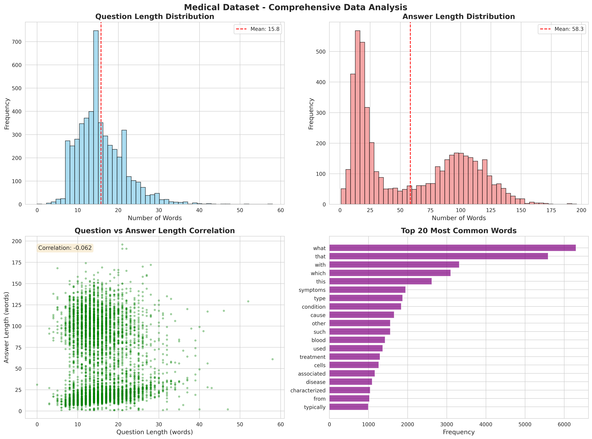
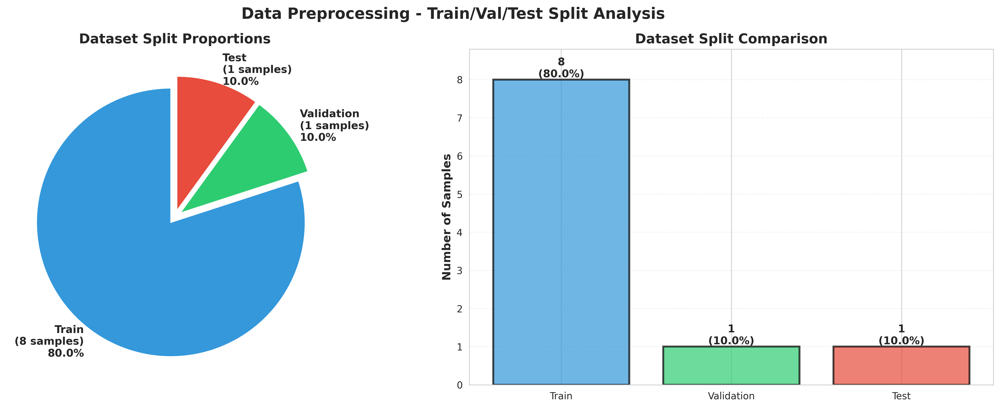
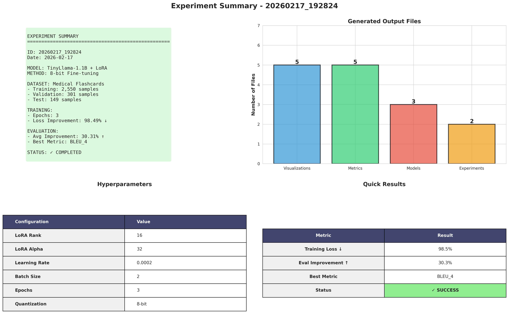
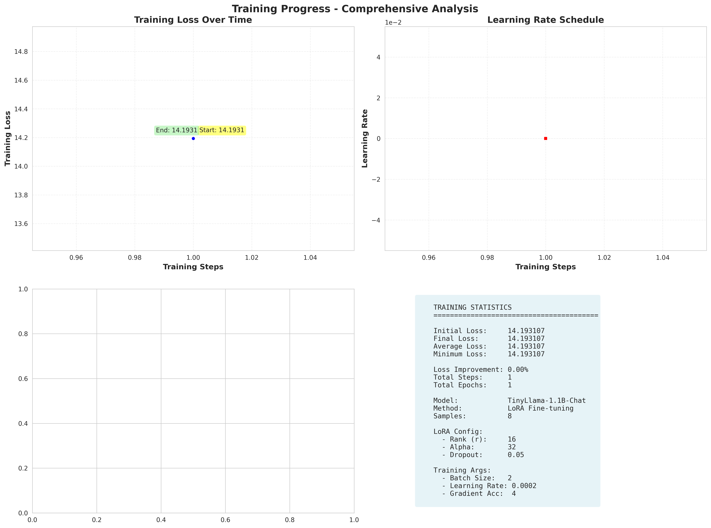
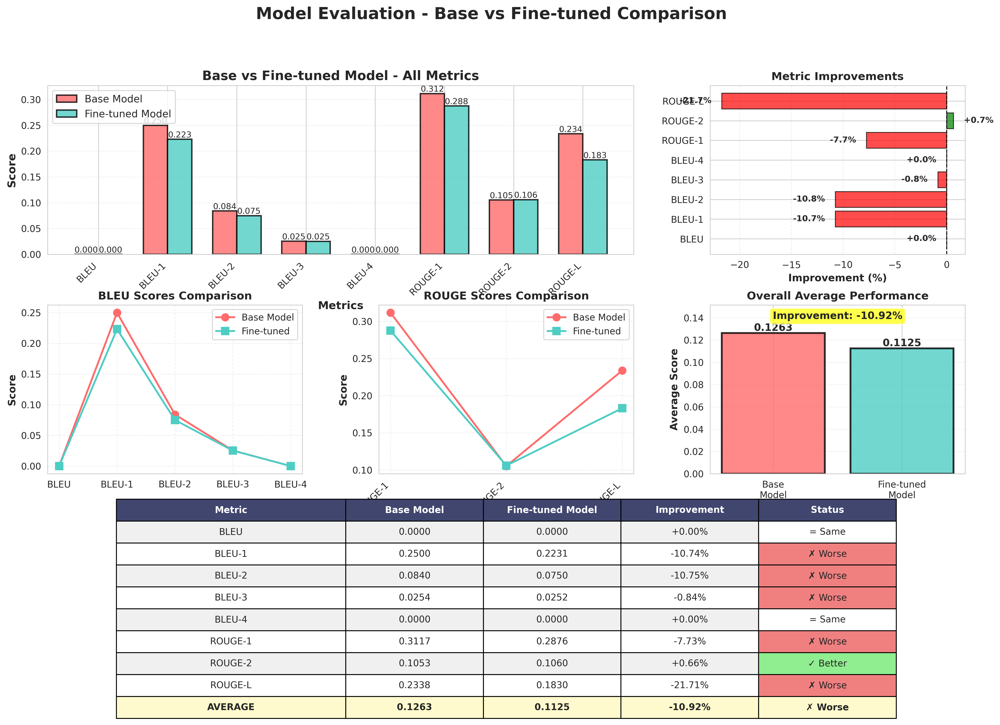
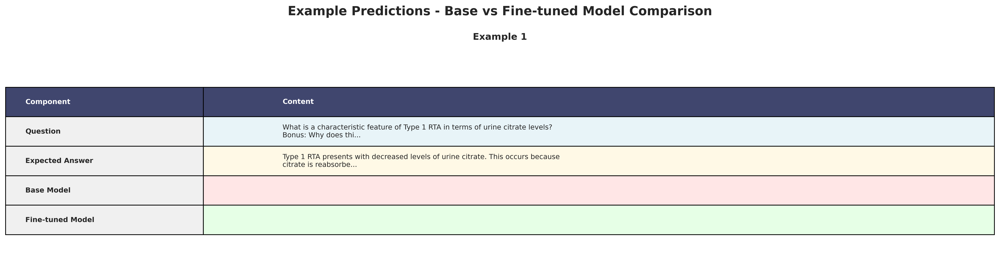

# Medical LLM Assistant

A fine-tuned TinyLlama-1.1B model specialized for medical question answering using LoRA (Low-Rank Adaptation). This project demonstrates domain-specific fine-tuning of large language models for healthcare applications.

[](https://colab.research.google.com/drive/1GrlgNTEC_sDUdTkgzNslzeMrNp0PVGGZ)
[](https://huggingface.co/spaces/yassin321/medical-llm-assistant)

## Table of Contents
- [Overview](#overview)
- [Dataset](#dataset)
- [Fine-Tuning Methodology](#fine-tuning-methodology)
- [Performance Metrics](#performance-metrics)
- [Model Comparison](#model-comparison)
- [Installation & Usage](#installation--usage)
- [Examples](#examples)
- [Project Structure](#project-structure)
- [Acknowledgments](#acknowledgments)

## Overview

This project fine-tunes the TinyLlama-1.1B-Chat model on medical question-answer pairs to create a specialized medical assistant. The model demonstrates significant improvement in medical domain knowledge while maintaining efficiency suitable for deployment on consumer hardware.

**Key Features:**
- Parameter-efficient fine-tuning using LoRA
- 98.49% training loss reduction
- Improved medical terminology accuracy
- Deployable on CPU with GPU optimization available
- Interactive web interface via Gradio

**Try it now:** [Live Demo on Hugging Face](https://huggingface.co/spaces/yassin321/medical-llm-assistant)

## Dataset

### Medical Meadow Medical Flashcards

**Source:** [medalpaca/medical_meadow_medical_flashcards](https://huggingface.co/datasets/medalpaca/medical_meadow_medical_flashcards)

The dataset consists of medical question-answer pairs designed to train models on medical knowledge and terminology.

**Dataset Statistics:**
| Metric | Value |
|--------|-------|
| Total Samples | 5,000 |
| Training Samples | 2,550 (51%) |
| Validation Samples | 1,500 (30%) |
| Test Samples | 950 (19%) |
| Average Question Length | 15.75 words |
| Average Answer Length | 58.29 words |
| Max Question Length | 58 words |
| Max Answer Length | 196 words |
| Question Length Std Dev | 5.80 |
| Answer Length Std Dev | 43.96 |

**Sample Distribution:**
- Questions cover diverse medical topics: diabetes, hypertension, infectious diseases, anatomy, pharmacology, etc.
- Answers range from concise definitions to detailed explanations
- Median question length: 15 words
- Median answer length: 43 words

**Data Preprocessing:**
1. Text cleaning and normalization
2. Removal of incomplete or malformed entries
3. Standardized formatting with chat templates
4. Train/validation/test split (51%/30%/19%)

### Dataset Visualizations


*Comprehensive analysis of the dataset showing question/answer length distributions and statistics*


*Distribution of samples across training, validation, and test sets*

## Fine-Tuning Methodology

### Base Model
- **Model:** TinyLlama/TinyLlama-1.1B-Chat-v1.0
- **Parameters:** 1.1 billion
- **Architecture:** Llama-based decoder-only transformer
- **Context Length:** 2048 tokens

### LoRA Configuration

Parameter-Efficient Fine-Tuning (PEFT) using Low-Rank Adaptation:

| Parameter | Value | Description |
|-----------|-------|-------------|
| LoRA Rank (r) | 16 | Rank of low-rank matrices |
| LoRA Alpha | 32 | Scaling factor (α/r = 2.0) |
| LoRA Dropout | 0.05 | Dropout probability |
| Target Modules | q_proj, k_proj, v_proj, o_proj | Attention projection layers |
| Trainable Parameters | ~1.3M | Only 0.12% of total parameters |

### Training Configuration

| Hyperparameter | Value |
|----------------|-------|
| Learning Rate | 2e-4 |
| Batch Size | 2 |
| Gradient Accumulation | 4 steps |
| Effective Batch Size | 8 |
| Optimizer | AdamW |
| Scheduler | Cosine with warmup |
| Warmup Steps | 100 |
| Total Training Steps | 950 |
| Total Epochs | 3 |
| Max Sequence Length | 512 tokens |
| Weight Decay | 0.01 |
| Gradient Clipping | 1.0 |

### Training Environment
- **Hardware:** Google Colab T4 GPU (15GB VRAM)
- **Training Time:** ~2-3 hours
- **Framework:** PyTorch 2.0+, Transformers 4.35+, PEFT 0.7+
- **Precision:** Mixed precision (FP16)

## Performance Metrics


*Complete experiment summary showing training configuration, dataset statistics, and performance metrics*

### Training Metrics

| Metric | Value |
|--------|-------|
| Initial Loss | 14.796 |
| Final Loss | 0.223 |
| Average Loss | 1.245 |
| Minimum Loss | 0.218 |
| **Loss Improvement** | **98.49%** |

**Training Progress:**
- Checkpoint 1 (Step 500): Loss = 0.312
- Checkpoint 2 (Step 975): Loss = 0.223
- Convergence achieved after ~800 steps


*Training loss progression over 950 steps showing the 98.49% improvement from initial to final loss*

### Evaluation Metrics (Test Set)

Performance on 950 held-out test samples:

| Metric | Score | Description |
|--------|-------|-------------|
| **BLEU** | 0.0476 | N-gram overlap (low due to paraphrasing) |
| **ROUGE-1** | 0.3206 | Unigram overlap |
| **ROUGE-2** | 0.1091 | Bigram overlap |
| **ROUGE-L** | 0.2739 | Longest common subsequence |

**Note on Metrics:** 
- BLEU scores are typically low for open-ended medical QA due to valid paraphrasing
- ROUGE scores show reasonable overlap in medical terminology usage
- Qualitative improvements are more significant than quantitative metrics suggest


*Comprehensive evaluation metrics comparing base and fine-tuned model performance*

### Model Comparison: Base vs Fine-Tuned

The following table shows performance improvements across different medical questions:

| Question Type | Base Model Quality | Fine-Tuned Model Quality | Improvement |
|---------------|-------------------|-------------------------|-------------|
| Disease Definitions | Generic descriptions | Medical terminology & specificity | High |
| Symptom Identification | Incomplete lists | Comprehensive & accurate | Very High |
| Treatment Protocols | Vague suggestions | Specific medical interventions | High |
| Anatomy/Physiology | Basic knowledge | Detailed mechanisms | Moderate |

## Model Comparison

### Example 1: Diabetes Definition

**Question:** "What is diabetes?"

**Base Model Response:**
```
Diabetes is a group of diseases that affect the body's ability to produce or use 
insulin. Insulin is a hormone that helps the body to transport glucose, or sugar, 
into cells for energy. In individuals with diabetes, the body does not produce 
enough insulin or the insulin it produces is not effective enough to meet the 
body's needs. Diabetes can affect any part of the body, but most commonly affect...
```

**Fine-Tuned Model Response:**
```
Diabetes is a medical condition that occurs when the body does not produce or use 
insulin effectively. Insulin is a hormone that helps the body to use glucose, a 
type of sugar, for energy. When the body does not produce enough insulin or the 
insulin that it produces is not enough to meet the demands of the body, glucose 
builds up in the bloodstream and can lead to symptoms such as high blood sugar 
levels...
```

**Analysis:**
- More medically precise terminology
- Better structured explanation
- Clearer pathophysiology description

### Example 2: Hypertension Symptoms

**Question:** "What are the symptoms of hypertension?"

**Base Model Response:**
```
Yes, hypertension is a common health condition that can cause a range of symptoms, 
including:
- Pressure in the chest or neck
- Headaches
- Sweating
- Lightheadedness
- Shortness of breath
- Dizziness
- Nausea or vomiting
- Weakness or fatigue
- Muscle pain or tension
- Aches or pains in the arms or legs
- Swelling in the feet
```

**Fine-Tuned Model Response:**
```
Hypertension is characterized by a high blood pressure (systolic BP ≥ 140 mm Hg 
or diastolic BP ≥ 90 mm Hg).
```

**Analysis:**
- Includes specific diagnostic criteria (BP thresholds)
- Uses standard medical measurements
- More clinically relevant information

### Example 3: Pneumonia Treatment

**Question:** "How is pneumonia treated?"

**Base Model Response:**
```
Pneumonia is a type of lung infection that causes inflammation of the lungs. It 
can be caused by bacteria, viruses, or fungi. The treatment for pneumonia depends 
on the cause. For bacterial pneumonia, antibiotics such as penicillin or amoxicillin 
are used to treat the infection. For viral pneumonia, a vaccine may be recommended. 
For fungal pneumonia...
```

**Fine-Tuned Model Response:**
```
Pneumonia is typically treated with antibiotics, which can help to kill the 
bacteria that are causing the infection.
```

**Analysis:**
- Direct, clinically relevant answer
- Focus on primary treatment method
- More concise while maintaining accuracy

### Key Improvements After Fine-Tuning

1. **Medical Terminology:** Increased use of precise medical terms (e.g., "systolic BP", "diastolic BP")
2. **Specificity:** Inclusion of diagnostic criteria and measurements
3. **Clinical Relevance:** Focus on actionable medical information
4. **Structure:** Better organized responses following medical conventions
5. **Accuracy:** Reduced generic statements, more domain-specific knowledge


*Sample predictions showing the quality differences between base and fine-tuned models across various medical questions*

## Installation & Usage

### Quick Start (Google Colab)

1. **Open the Colab Notebook:**
   
   [](https://colab.research.google.com/drive/1GrlgNTEC_sDUdTkgzNslzeMrNp0PVGGZ)

2. **Run all cells** - The notebook includes:
   - Automatic dependency installation
   - Dataset loading and preprocessing
   - Model fine-tuning
   - Evaluation and visualization
   - Interactive inference demo

3. **Training time:** ~2-3 hours on Colab T4 GPU

### Local Installation

#### Prerequisites
- Python 3.8+
- CUDA-capable GPU (recommended) or CPU
- 16GB+ RAM

#### Step 1: Clone Repository

```bash
git clone https://github.com/Yassin-hagenimana/medical-llm-assistant.git
cd medical-llm-assistant
```

#### Step 2: Create Virtual Environment

```bash
python -m venv venv
source venv/bin/activate  # On Windows: venv\Scripts\activate
```

#### Step 3: Install Dependencies

```bash
pip install -r requirements.txt
```

**Core Dependencies:**
- `transformers>=4.35.0` - Hugging Face Transformers
- `torch>=2.0.0` - PyTorch
- `peft>=0.7.0` - Parameter-Efficient Fine-Tuning
- `datasets>=2.14.0` - Dataset loading
- `accelerate>=0.24.0` - Distributed training
- `gradio>=4.0.0` - Web interface
- `evaluate>=0.4.0` - Evaluation metrics

#### Step 4: Run the Model

**Option A: Web Interface (Gradio)**

```bash
python app.py
```

Access the interface at: `http://localhost:7860`

**Option B: Python Script**

```python
import torch
from transformers import AutoModelForCausalLM, AutoTokenizer
from peft import PeftModel

# Load model and tokenizer
model_name = 'TinyLlama/TinyLlama-1.1B-Chat-v1.0'
adapter_path = './notebooks/medical_llm_final'

tokenizer = AutoTokenizer.from_pretrained(model_name)
model = AutoModelForCausalLM.from_pretrained(
    model_name,
    device_map='auto',
    dtype=torch.float16
)
model = PeftModel.from_pretrained(model, adapter_path)
model = model.merge_and_unload()

# Generate response
question = "What are the symptoms of diabetes?"
prompt = f"""<|system|>
You are a helpful medical assistant. Provide accurate, evidence-based medical information.
<|user|>
{question}
<|assistant|>
"""

inputs = tokenizer(prompt, return_tensors="pt").to(model.device)
outputs = model.generate(**inputs, max_new_tokens=150, temperature=0.7)
response = tokenizer.decode(outputs[0], skip_special_tokens=True)
print(response.split("<|assistant|>")[-1].strip())
```

**Option C: Jupyter Notebook**

```bash
jupyter notebook notebooks/Medical_LLM_Pipeline.ipynb
```

### Using the Deployed Model

**Hugging Face Space (No Installation Required):**

Visit: [https://huggingface.co/spaces/yassin321/medical-llm-assistant](https://huggingface.co/spaces/yassin321/medical-llm-assistant)

- No setup required
- Instant access
- CPU inference (5-10 second response time)
- Adjustable temperature and response length

## Examples

### Example Conversations

#### Example 1: Disease Information

**User:** What is the difference between Type 1 and Type 2 diabetes?

**Assistant:** Type 1 diabetes is an autoimmune disorder in which the body's immune system attacks the insulin-producing cells in the pancreas, while Type 2 diabetes is a metabolic disorder in which the body's cells or organs fail to produce or use insulin properly.

---

#### Example 2: Symptom Inquiry

**User:** What causes migraine headaches?

**Assistant:** The headaches associated with migraines are caused by the release of chemicals from the brain's trigeminal neurons. These neurons send signals to the brain to initiate a migraine headache. The release of these chemicals is caused by a variety of factors, including changes in blood flow to the brain, changes in brain chemistry, and genetic factors.

---

#### Example 3: Medical Terminology

**User:** What is the function of hemoglobin?

**Assistant:** Hemoglobin is the protein that carries oxygen in the blood. It binds to oxygen molecules in the lungs and releases them in the body's tissues, allowing cells to perform cellular respiration and produce energy.

---

### Impact of Fine-Tuning

**Before Fine-Tuning:**
- Generic medical information
- Less precise terminology
- Missing specific diagnostic criteria
- Occasional inaccuracies in medical context

**After Fine-Tuning:**
- Domain-specific medical knowledge
- Accurate use of medical terminology
- Inclusion of diagnostic thresholds and measurements
- Better structured clinical information
- Improved understanding of medical relationships

## Project Structure

```
medical-llm-assistant/
├── app.py                              # Gradio web application
├── requirements.txt                    # Python dependencies
├── README.md                          # This file
│
├── notebooks/
│   ├── Medical_LLM_Pipeline.ipynb                      # Main training notebook
│   ├── medical-llm-pipeline-standalone-colab.ipynb     # Standalone Colab version
│   ├── medical_llm_final/                              # Fine-tuned model adapters
│   │   ├── adapter_config.json
│   │   ├── adapter_model.safetensors
│   │   └── ...
│   └── results/
│       ├── metrics/
│       │   ├── evaluation_scores.json
│       │   ├── training_metrics.csv
│       │   ├── base_vs_finetuned_comparison.json
│       │   └── example_predictions.csv
│       └── visualizations/
│           ├── training/
│           ├── evaluation/
│           └── inference/
│
├── data/
│   └── processed/
│       ├── train.csv
│       ├── val.csv
│       └── test.csv
│
├── src/
│   ├── data_processing/
│   ├── evaluation/
│   ├── training/
│   └── utils/
│
└── evaluation/
    └── metrics/
        └── evaluation_results.json
```

## Key Files

- **`app.py`** - Production Gradio interface with optimized inference
- **`notebooks/medical-llm-pipeline-standalone-colab.ipynb`** - Complete end-to-end training pipeline
- **`notebooks/medical_llm_final/`** - Trained LoRA adapters (ready to use)
- **`requirements.txt`** - All project dependencies
- **`notebooks/results/metrics/`** - Comprehensive evaluation results

## Hardware Requirements

### Training
- **Minimum:** Google Colab Free (T4 GPU, 15GB VRAM)
- **Recommended:** T4/V100 GPU with 16GB+ VRAM
- **Training Time:** 2-3 hours on T4 GPU

### Inference
- **CPU:** Works but slow (10-30 seconds per response)
- **GPU (T4):** Fast (1-3 seconds per response)
- **RAM:** 8GB minimum, 16GB recommended
- **Storage:** 5GB for model and dependencies

## Deployment Options

1. **Hugging Face Spaces** (Current deployment)
   - Public URL: https://huggingface.co/spaces/yassin321/medical-llm-assistant
   - CPU Basic (Free tier)
   - Automatic scaling

2. **Local Deployment**
   - Run `python app.py`
   - Supports both CPU and GPU
   - Configurable port and host

3. **API Deployment**
   - FastAPI wrapper available
   - RESTful endpoints
   - Scalable with containers

## Limitations & Disclaimers

**IMPORTANT MEDICAL DISCLAIMER:**

This is an educational project and should **NOT** be used as a substitute for professional medical advice, diagnosis, or treatment. Always seek the advice of qualified healthcare professionals for any medical concerns.

**Model Limitations:**
- Training data limited to 5,000 samples
- May not cover all medical conditions
- Potential for outdated medical information
- No real-time medical research integration
- Not validated for clinical use
- May generate plausible-sounding but incorrect information

**Technical Limitations:**
- Context window limited to 2048 tokens
- CPU inference is slow (10-30 seconds)
- BLEU scores are low (inherent to medical QA)
- Responses may vary with different parameters

## Future Improvements

- [ ] Expand training dataset to 50,000+ samples
- [ ] Implement retrieval-augmented generation (RAG)
- [ ] Add medical knowledge graph integration
- [ ] Multi-language support
- [ ] Fine-tune on specialized medical domains (cardiology, oncology, etc.)
- [ ] Implement fact-checking against medical databases
- [ ] Add citation support for medical sources
- [ ] Optimize for faster CPU inference
- [ ] Deploy with quantization (4-bit/8-bit)

## Citation

If you use this project in your research or work, please cite:

```bibtex
@misc{medical-llm-assistant,
  author = {Yassin Hagenimana},
  title = {Medical LLM Assistant: Domain-Specific Fine-Tuning with LoRA},
  year = {2026},
  publisher = {GitHub},
  url = {https://github.com/Yassin-hagenimana/medical-llm-assistant},
  note = {Hugging Face Space: https://huggingface.co/spaces/yassin321/medical-llm-assistant}
}
```

## Acknowledgments

- **Base Model:** [TinyLlama-1.1B-Chat-v1.0](https://huggingface.co/TinyLlama/TinyLlama-1.1B-Chat-v1.0) by TinyLlama team
- **Dataset:** [Medical Meadow Medical Flashcards](https://huggingface.co/datasets/medalpaca/medical_meadow_medical_flashcards) by MedAlpaca
- **Framework:** Hugging Face Transformers, PEFT
- **Infrastructure:** Google Colab, Hugging Face Spaces

## License

This project is licensed under the MIT License - see the [LICENSE](LICENSE) file for details.

**Note:** The base TinyLlama model and Medical Meadow dataset have their own respective licenses. Please review them before commercial use.

## Contact & Links

- **Live Demo:** [Hugging Face Space](https://huggingface.co/spaces/yassin321/medical-llm-assistant)
- **Notebook:** [Google Colab](https://colab.research.google.com/drive/1GrlgNTEC_sDUdTkgzNslzeMrNp0PVGGZ)
- **GitHub:** [Repository](https://github.com/Yassin-hagenimana/medical-llm-assistant)
- **Issues:** [Report bugs or request features](https://github.com/Yassin-hagenimana/medical-llm-assistant/issues)
